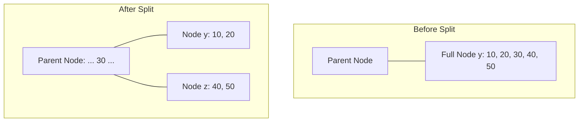
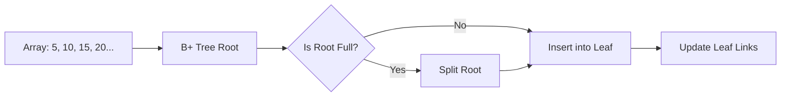

# B-Tree Implementation Documentation

This document provides an in-depth explanation of the B-Tree data structure and its implementation in `b-tree.cpp`.

## 1. What is a B-Tree?

A B-Tree is a self-balancing tree data structure that maintains sorted data and allows searches, sequential access, insertions, and deletions in logarithmic time. It is a generalization of a binary search tree in that a node can have more than two children.

### Key Properties:
- All leaves are at the same level.
- A B-Tree is defined by the term **minimum degree `t`**.
- Every node except the root must contain at least `t-1` keys.
- Every node can contain at most `2t-1` keys.
- A non-leaf node with `n` keys has `n+1` children.
- All keys of a node are sorted in increasing order.

---

## 2. Code Logic Breakdown

### Constants and Structure
```cpp
4: const int t = 3; // minimum degree
5: const int MAX_KEYS = 2 * t - 1;   // Maximum 5 keys for t=3
6: const int MAX_CHILDREN = 2 * t;  // Maximum 6 children for t=3

8: struct BTreeNode
9: {
10:     int keys[MAX_KEYS];          // Array to store keys
11:     BTreeNode *children[MAX_CHILDREN]; // Array of pointers to children
12:     int n;                       // Current number of keys in the node
13:     bool isLeaf;                 // True if node is a leaf, false otherwise
14: };
```
- **Line 4-6**: Defines the capacity of each node based on the minimum degree `t`.
- **Line 8-14**: The `BTreeNode` structure is the building block. It holds an array for keys and another for children pointers. `n` tracks how many keys are actually used.

### Node Creation (`createNode`)
```cpp
16: BTreeNode *createNode(bool leaf)
17: {
18:     BTreeNode *newNode = new BTreeNode(); // Allocate memory
19:     newNode->isLeaf = leaf;               // Set if it's a leaf
20:     newNode->n = 0;                       // Initially 0 keys
21: 
22:     for (int i = 0; i < MAX_CHILDREN; i++) // Initialize child pointers to NULL
23:     {
24:         newNode->children[i] = NULL;
25:     }
26: 
27:     return newNode;
28: }
```
- **Loop (Lines 22-25)**: Ensures that no "garbage" pointers exist in the `children` array, which is crucial for safe traversal and searching.

### Traversal (`traverse`)
This is a recursive function that prints keys in sorted order.
```cpp
38:     for (i = 0; i < root->n; i++)
39:     {
40:         if (root->isLeaf == false) // If not a leaf, visit the child first
41:         {
42:             traverse(root->children[i]);
43:         }
44:         cout << root->keys[i] << " "; // Then print the key
45:     }
48:     if (root->isLeaf == false) // Finally, visit the last child
49:     {
50:         traverse(root->children[i]);
51:     }
```
- **Logic**: For `n` keys, there are `n+1` children. The loop visits child `i`, then key `i`. After the loop, it visits child `n`.

### Search (`search`)
```cpp
64:     while (i < root->n && key > root->keys[i])
65:     {
66:         i++;
67:     }
```
- **Line 64-67**: This loop finds the first key that is greater than or equal to the target `key`.
- **Line 70-73**: If the key is found in the current node, return the node.
- **Line 82**: If not found and not a leaf, recursively search the appropriate child `i`.

---

## 3. Visual Demonstration: Splitting a Node (`splitChild`)

The `splitChild` function is the most complex part. It is called when a child node `y` of a `parent` node is full (has `2t-1` keys).

### The Scenario (t=3)
- Node `y` (child of `parent` at index `i`) is full with 5 keys: `[10, 20, 30, 40, 50]`
- `parent` needs to accommodate the median key (`30`).

### Step-by-Step Logic
1.  **Create Node `z`**: A new node that will hold the larger half of `y`'s keys.
2.  **Move Keys**: Copy the last `t-1` keys from `y` to `z`.
3.  **Move Children**: If `y` isn't a leaf, copy the last `t` children from `y` to `z`.
4.  **Update `y->n`**: Reduce key count of `y` to `t-1`.
5.  **Shift Parent Children**: Make space in `parent->children` for the new pointer to `z`.
6.  **Shift Parent Keys**: Make space in `parent->keys` for the median key from `y`.
7.  **Push Median Up**: Move `y->keys[t-1]` (the middle one) to `parent`.

### Visual Diagram


---

## 4. Plan: Converting to B+ Tree

A B+ Tree differs from a B-Tree primarily in how it stores data and links leaf nodes.

### Required Architectural Changes
1.  **Data at Leaves Only**: Internal nodes should only store keys for navigation, not actual data values (though in this C++ code, keys and data are the same `int`).
2.  **Linked Leaves**: Each leaf node must have a `next` pointer to the next leaf node to allow efficient range queries.
3.  **Split Logic Adjustment**: 
    - When a leaf splits, the middle key is "copied" up to the parent, but it also remains in the right-hand leaf (`z`).
    - When an internal node splits, the middle key is "moved" up (same as B-Tree).

### Implementation Steps
1.  **Modify `BTreeNode`**:
    ```cpp
    struct BTreeNode {
        int keys[MAX_KEYS];
        BTreeNode *children[MAX_CHILDREN];
        BTreeNode *next; // NEW: Pointer to next leaf
        int n;
        bool isLeaf;
    };
    ```
2.  **Update `splitChild`**:
    - Add logic to link `y->next = z` and `z->next = old_y_next` if `y` is a leaf.
    - If `isLeaf` is true, Ensure `y->keys[t-1]` stays in `z->keys[0]` while also going up to `parent`.
3.  **Update `traverse`**:
    - Can now be done linearly by following the `next` pointers starting from the leftmost leaf.
4.  **Insert from Array**:
    - Iterate through the array and call `insert(key)` for each element. The B-Tree logic naturally handles the balancing.

### Suggested Data Flow for Construction from Array


---

> [!TIP]
> **Code Correction Note:** In your `splitChild` function at line 97, `z->keys[i] = y->keys[j + t];` should be `z->keys[j] = y->keys[j + t];`. The index `i` is for the parent, while `j` is the local index for the new node `z`.
